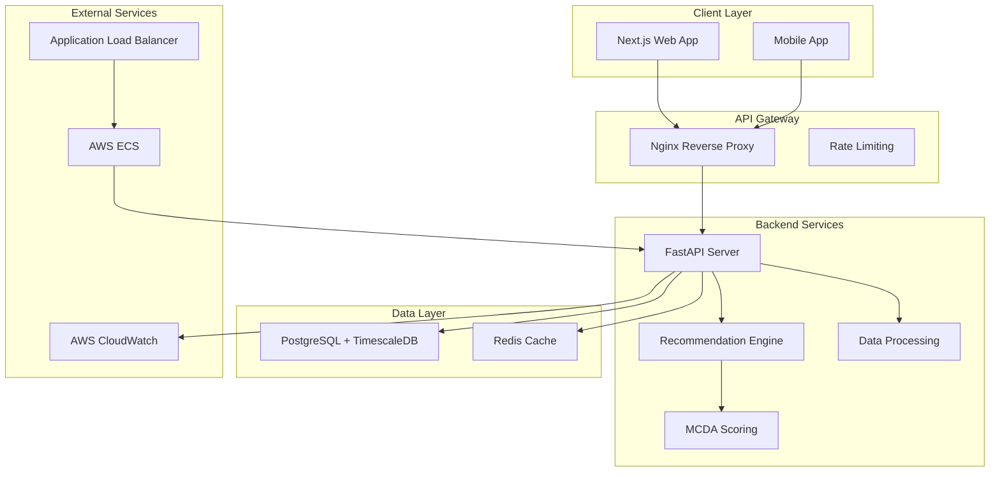
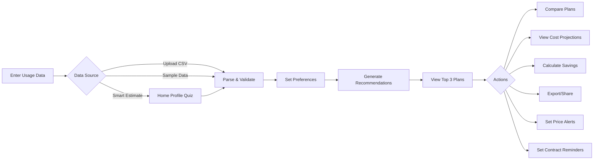

# AI Energy Plan Recommendation Agent

**Organization:** Arbor
**Status:** Production Ready (100% Complete)

---

## Overview

The AI Energy Plan Recommendation Agent is an intelligent solution that helps customers in deregulated energy markets find optimal energy plans. It analyzes usage patterns, preferences, and existing plans to provide personalized, explainable recommendations for the top 3 energy plans.

## Architecture



## User Flow



## Key Features

### Core Recommendation Engine

- Multi-Criteria Decision Analysis (MCDA) for intelligent plan ranking
- Personalized recommendations based on user preferences
- Plain-language explanations for each recommendation
- Risk flagging for variable rates, long contracts, and high early termination fees
- Seasonal usage pattern detection

### Enhanced User Interface

- **Plan Comparison View** - Side-by-side comparison of recommended plans
- **Cost Projection Chart** - 12-month visual cost projections with seasonal patterns
- **Savings Calculator** - Interactive what-if analysis with adjustable usage
- **Smart Defaults** - Usage estimation based on home type, size, and climate
- **Switching Guide** - Step-by-step guide for switching energy providers
- **Historical Rate Comparison** - Compare current rates against market history
- **Price Drop Alerts** - Email notifications when rates drop below targets
- **Contract Reminders** - Calendar integration and email reminders for contract end dates
- **Export & Share** - PDF and CSV export of recommendations

### Compliance & Security

- GDPR-compliant data handling with data subject rights
- WCAG 2.1 accessible interface
- Rate limiting and input validation
- TLS 1.3 encryption

## Tech Stack

| Component | Technology |
|-----------|------------|
| Backend | Python 3.11, FastAPI, SQLAlchemy 2.0 |
| Frontend | Next.js 15, React 19, TypeScript, Tailwind CSS |
| Database | PostgreSQL with TimescaleDB |
| Cache | Redis |
| Infrastructure | Docker, Nginx, AWS (ECS, RDS, ElastiCache) |

## Quick Start

### Prerequisites

- Docker & Docker Compose
- Python 3.11+
- Node.js 20+
- pnpm

### Development Setup

```bash
# Clone the repository
git clone https://github.com/Davaakhatan/arbor-energy-plan-agent.git
cd arbor-energy-plan-agent

# Start infrastructure services
docker-compose up -d postgres redis

# Backend setup
cd backend
python -m venv venv
source venv/bin/activate
pip install -e ".[dev]"
alembic upgrade head
python -m app.scripts.seed_data
uvicorn app.main:app --reload --port 8000

# Frontend setup (new terminal)
cd frontend
pnpm install
pnpm dev
```

### Access

- **Frontend**: <http://localhost:3000>
- **Backend API**: <http://localhost:8000>
- **API Documentation**: <http://localhost:8000/docs>

## Project Structure

```
arbor-energy-plan-agent/
├── backend/                 # FastAPI backend
│   ├── app/
│   │   ├── api/v1/         # API endpoints
│   │   ├── core/           # Config, database, logging
│   │   ├── middleware/     # Rate limiting, timing
│   │   ├── models/         # SQLAlchemy models
│   │   ├── repositories/   # Database access layer
│   │   ├── schemas/        # Pydantic schemas
│   │   └── services/       # Business logic (recommendation, scoring)
│   ├── alembic/            # Database migrations
│   └── tests/              # Test suites (unit, e2e, security, performance)
├── frontend/               # Next.js frontend
│   └── src/
│       ├── app/            # Next.js app router
│       ├── components/     # React components
│       └── lib/            # API client, utilities
├── docs/                   # Documentation
├── monitoring/             # CloudWatch configs, alerts
├── nginx/                  # Reverse proxy config
└── .github/workflows/      # CI/CD pipelines
```

## Documentation

| Document | Description |
|----------|-------------|
| [PRD.md](docs/PRD.md) | Product Requirements Document |
| [ARCHITECTURE.md](docs/ARCHITECTURE.md) | System architecture |
| [TASKS.md](docs/TASKS.md) | Task tracking and progress |
| [DEVELOPER_GUIDE.md](docs/DEVELOPER_GUIDE.md) | Developer onboarding |
| [API_USER_GUIDE.md](docs/API_USER_GUIDE.md) | API integration guide |
| [DEPLOYMENT.md](docs/DEPLOYMENT.md) | Production deployment |
| [GDPR_COMPLIANCE.md](docs/GDPR_COMPLIANCE.md) | GDPR compliance |
| [PRIVACY_POLICY.md](docs/PRIVACY_POLICY.md) | Privacy policy |

## API Endpoints

| Method | Endpoint | Description |
|--------|----------|-------------|
| POST | `/api/v1/customers` | Create customer with usage data |
| GET | `/api/v1/customers/{id}` | Get customer details |
| PUT | `/api/v1/preferences/{id}` | Update preferences |
| POST | `/api/v1/recommendations` | Generate recommendations |
| GET | `/api/v1/plans` | List available plans |
| GET | `/api/v1/health` | Health check |
| GET | `/api/v1/metrics` | Application metrics |

## Performance

- **Target**: < 2 seconds for recommendation generation
- **Caching**: Redis with cache warming
- **Optimization**: Database indexes, eager loading, connection pooling

## Testing

```bash
# Backend tests
cd backend
pytest                          # All tests
pytest --cov=app               # With coverage
pytest tests/unit/             # Unit tests only
pytest tests/e2e/              # End-to-end tests
pytest tests/security/         # Security tests

# Frontend tests
cd frontend
pnpm test                      # All tests
pnpm test:coverage            # With coverage

# Load testing
cd backend
locust -f tests/performance/locustfile.py --host=http://localhost:8000
```

## Deployment

```bash
# Production build
docker-compose -f docker-compose.prod.yml build

# Deploy
docker-compose -f docker-compose.prod.yml --env-file .env.production up -d
```

See [DEPLOYMENT.md](docs/DEPLOYMENT.md) for detailed deployment instructions.

## Compliance

- **GDPR**: Full compliance with data subject rights
- **WCAG 2.1**: Accessible UI with semantic HTML, ARIA labels, keyboard navigation
- **Security**: Rate limiting, input validation, SQL injection prevention, TLS 1.3

## Project Status

| Phase | Status | Completion |
|-------|--------|------------|
| Setup & Planning | ✅ Complete | 100% |
| Data Infrastructure | ✅ Complete | 100% |
| Recommendation Engine | ✅ Complete | 100% |
| Preferences & Scoring | ✅ Complete | 100% |
| Risk Awareness | ✅ Complete | 100% |
| API Development | ✅ Complete | 100% |
| Frontend | ✅ Complete | 100% |
| Performance | ✅ Complete | 100% |
| Security | ✅ Complete | 100% |
| Testing | ✅ Complete | 100% |
| Deployment | ✅ Complete | 100% |
| Documentation | ✅ Complete | 100% |

### Overall: 100% Complete

## Features Beyond Original PRD

The following features were implemented beyond the original PRD requirements:

| Feature | Description | Status |
|---------|-------------|--------|
| Plan Comparison View | Side-by-side comparison of up to 3 plans | ✅ |
| Cost Projection Chart | 12-month visual cost projections | ✅ |
| Savings Calculator | Interactive what-if analysis tool | ✅ |
| Smart Defaults | Usage estimation from home profile | ✅ |
| Switching Guide | Step-by-step provider switching guide | ✅ |
| Historical Rate Comparison | Market rate history visualization | ✅ |
| Price Drop Alerts | Email notifications for rate drops | ✅ |
| Contract Reminders | Calendar/email contract end reminders | ✅ |
| Export & Share | PDF/CSV recommendation export | ✅ |
| CSV Upload | Bulk usage data upload | ✅ |

## License

MIT License

---

For questions or support, contact: <dev@arbor-energy.com>
